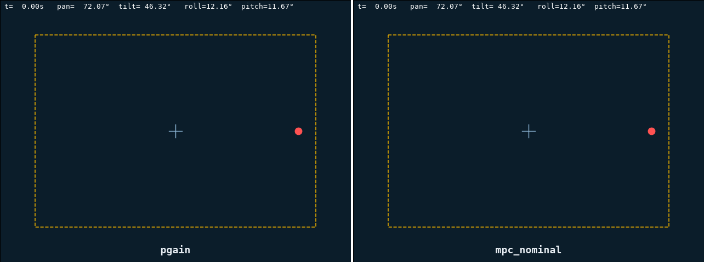
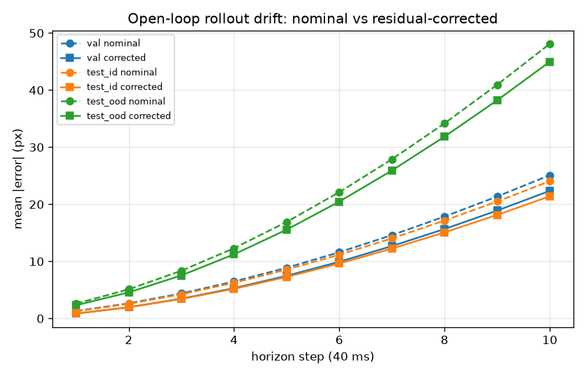
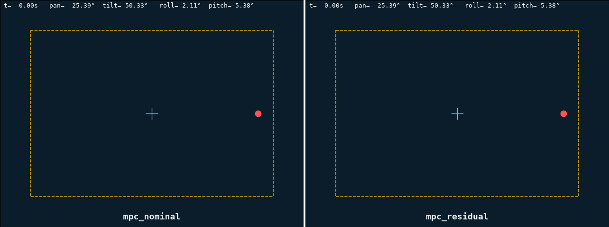

# Predictive Visual Control under Wave Disturbances

[](https://www.python.org/)
[](https://numpy.org/)
[](https://pytorch.org/)

---

## Overview

A surface platform rolls and pitches under wave disturbances. It carries a submerged
pan-tilt camera, aimed at a fixed underwater target.

Nothing holds that target in frame. It drifts toward the image boundary, and eventually
leaves it. The goal is simple: keeping the target near the center of the image, by
reacting to - and/or predicting - the target trajectory.



Reactive vs predictive control animation. Same disturbance and same actuator limits on
both sides.

The image plane is the instrument. The dashed rectangle is the 64 px warning boundary, the
red dot is the target, the blue trail is its recent path. On the right, the green dotted
line is the MPC's predicted trajectory over its 10-step horizon.

The reactive P-servo on the left builds up lag against the wave, and the target exits the
frame at t≈15.7 s. The predictive controller on the right knows about its own 120-200 ms of
command and observation delay. It never enters the warning band.

The metric here is **episode retention**: the fraction of episodes completed without ever
losing the target. Not mean centering error. A controller can center better on average and
still drop the target more often, which makes it the worse controller. The learned residual
below is exactly that case.

The simulator and controller settings stay separate throughout. The simulator carries
motor-gain mismatch, a dead zone and delay queues. The model the controllers plan with
does not.

---

## Controllers

| name | description |
|---|---|
| `none` | zero action, uncompensated reference |
| `oracle` | per-step `aim_at` on true state; reference only, not delay-aware |
| `pgain` | reactive P control on normalized image error, anti-diagonal image-motion map |
| `jacobian` | reactive servo `q̇ = −λ J⁺ e`, 2×2 numeric Jacobian from nominal geometry |
| `mpc_nominal` | random shooting, K=256 × N=10, warm start; replays pending actions to model delay; damped attitude extrapolation (`rate_decay=0.7`) |
| `mpc_residual` | identical MPC on nominal + accumulated learned residual; only the model differs |

The trajectory cost combines centering, a soft warning-boundary term, an out-of-frame
penalty, effort and smoothness. Rollouts vectorize over the sample dimension. That fits
2560 simulated steps into 3.4 ms, against a 40 ms budget at 25 Hz.

---

## Results

Frozen benchmark, 10 test seeds per tier (seeds 1000-1029, never used for tuning).
Command and observation delays per tier are 0/0, 80/40 and 120/80 ms.

| tier | controller | retention | min margin (px) | mean err | ms/step |
|---|---|---|---|---|---|
| easy | `pgain` | 1.00 | 225.1 | 0.038 | 0.02 |
| easy | `mpc_nominal` | 1.00 | 222.7 | 0.027 | 3.2 |
| medium | `pgain` | 1.00 | 179.6 | 0.122 | 0.02 |
| medium | `mpc_nominal` | 1.00 | 200.8 | **0.069** | 3.4 |
| hard | `pgain` | 0.40 | 11.0 | 0.426 | 0.02 |
| hard | `jacobian` | 0.40 | 15.0 | 0.469 | 1.00 |
| hard | `mpc_nominal` | **0.90** | **50.3** | **0.262** | 3.4 |

Reactive failures happen with zero actuator saturations. They are lag-limited, not
torque-limited, which is why replanning against a delay model recovers them.

Uncompensated retention on the hard tier is 0.00. The truth-informed but delay-blind
`oracle` reaches 0.80, still below the MPC.

### Learned residual

The nominal model's one-step error is structured, not noise. It grows with attitude rate,
and with action magnitude. It runs from 0.18 px RMSE in calm conditions up to 4.3 px at
unseen wave frequencies.

So there is something to learn here. A 2×64 SiLU MLP on 14 aligned state/action features
corrects the single-step visual increment, accumulated per-step inside the rollout.



Open-loop drift over 10 steps, with executed actions replayed. One-step RMSE halves
(0.55 → 0.26 px on validation), and 10-step drift improves by about 11% in-distribution.
What remains is dominated by attitude extrapolation, which the residual cannot see at
rollout time.

None of that reaches the closed loop. On the hard tier `mpc_residual` improves mean error
(0.248 against 0.262), effort, and margins while tracking. It retains **0.70 against 0.90**.



Seed 1020, `mpc_nominal` left and `mpc_residual` right, identical hyperparameters.

The corrected controller tracks more tightly for most of the episode. Then it loses the
target on the half-sine roll impulse at t=8 s. Attitude rates there reach about 1.5 rad/s,
against a training distribution bounded near 0.8.

The correction is extrapolated exactly when the margin is thinnest. The physics-only model
has no such cliff. Over all 20 hard episodes: nominal 16/20, residual 14/20.

Halving the average prediction error bought nothing, because retention is not decided on
average. It is decided in the few seconds where the disturbance sits furthest from anything
in the training data. That is exactly where a learned correction is least reliable, and
where a physics model degrades instead of breaking.

---

## Layout

```
src/wavept/
  geometry/       frame chain R_WC = R_WB·Rz(q_p)·Ry(q_t)·Rx(π), pinhole camera, aim_at
  simulation/     sum-of-sines wave disturbance, pan-tilt dynamics, env (reset/step/render)
  perception/     synthetic detector with seeded dropouts
  control/        reactive servos, predictive controller, cost terms, factory
  models/         nominal visual model, learned residual, dataset collection
  evaluation/     episode runner, metrics, benchmark, robustness sweeps
  visualization/  image-plane renderer, video export
configs/          simulator and controller configs; benchmark_v1.yaml is frozen
```

Rough order of use: `run_demo.py` → `run_benchmark.py` → `collect_dataset.py` →
`audit_nominal_model.py` → `train_residual.py` → `run_robustness.py`.

```bash
python scripts/run_demo.py --benchmark-tier hard --compare pgain,mpc_nominal --seed 1021 --gif
python scripts/run_benchmark.py --controllers pgain,jacobian,mpc_nominal --split test
python scripts/run_robustness.py --name core
```

`mpc_residual` needs the checkpoint from `collect_dataset.py`, then `train_residual.py`.
